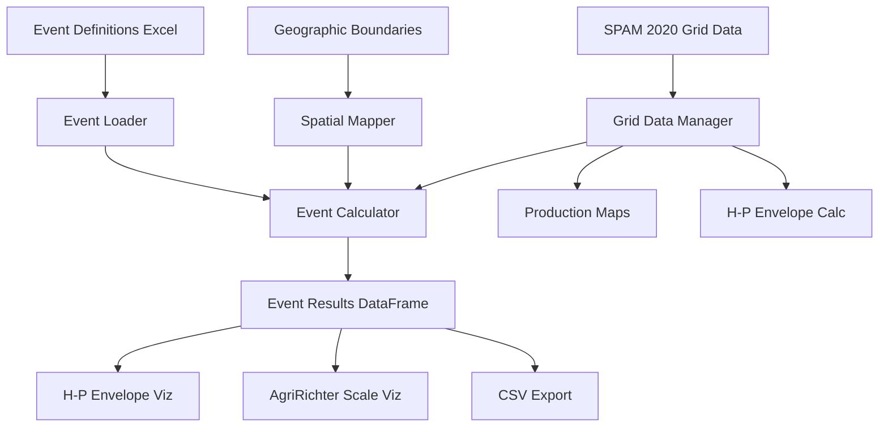

# Design Document

## Overview

This design document describes the implementation of the historical events calculation system for AgriRichter, completing the Python migration from MATLAB. The system calculates actual production losses and disrupted harvest areas for 21 historical agricultural disruption events by mapping geographic regions to SPAM 2020 gridded data.

The architecture follows a pipeline pattern: load event definitions → map to grid cells → calculate losses → integrate with visualizations. This enables generation of publication-quality figures with real historical data.

## Architecture

### High-Level Architecture



### Component Architecture

The system extends the existing AgriRichter package with new modules:

1. **Grid Data Manager** (`agririchter/data/grid_manager.py`): Manages SPAM 2020 gridded data with spatial indexing
2. **Spatial Mapper** (`agririchter/data/spatial_mapper.py`): Maps geographic regions to grid cells
3. **Event Calculator** (`agririchter/analysis/event_calculator.py`): Calculates losses for historical events
4. **Pipeline Orchestrator** (`agririchter/pipeline/events_pipeline.py`): End-to-end workflow coordination
5. **Validation Module** (`agririchter/validation/data_validator.py`): Data quality checks and validation

## Components and Interfaces

### Grid Data Manager

**Purpose**: Efficient loading and spatial indexing of SPAM 2020 gridded data.

**Interface**:
```python
class GridDataManager:
    def __init__(self, config: Config, spam_version: str = '2020')
    def load_spam_data(self) -> Tuple[pd.DataFrame, pd.DataFrame]
    def get_grid_cells_by_iso3(self, iso3_code: str) -> pd.DataFrame
    def get_grid_cells_by_coordinates(self, bounds: Tuple[float, float, float, float]) -> pd.DataFrame
    def create_spatial_index(self) -> None
    def get_crop_production(self, grid_cells: pd.DataFrame, crop_indices: List[int]) -> float
    def get_crop_harvest_area(self, grid_cells: pd.DataFrame, crop_indices: List[int]) -> float
    def validate_grid_data(self) -> Dict[str, Any]
```

**Key Responsibilities**:
- Load SPAM 2020 production and harvest area CSV files
- Create spatial index for efficient geographic queries
- Filter grid cells by country (ISO3) or spatial bounds
- Aggregate production and harvest area for selected crops
- Validate data completeness and coordinate consistency

**Implementation Details**:
- Use pandas for data loading with optimized dtypes
- Create GeoDataFrame with Point geometries for spatial operations
- Build spatial index (R-tree) for fast geographic queries
- Cache loaded data to avoid repeated file I/O
- Handle missing data and coordinate edge cases

### Spatial Mapper

**Purpose**: Map event geographic definitions to SPAM grid cells.

**Interface**:
```python
class SpatialMapper:
    def __init__(self, config: Config, grid_manager: GridDataManager)
    def load_boundary_data(self) -> None
    def load_country_codes_mapping(self) -> pd.DataFrame
    def map_country_to_grid_cells(self, country_code: float) -> List[str]
    def map_state_to_grid_cells(self, country_code: float, state_code: float) -> List[str]
    def get_iso3_from_country_code(self, country_code: float) -> Optional[str]
    def validate_spatial_mapping(self) -> Dict[str, Any]
```

**Key Responsibilities**:
- Load country code conversion table (GDAM to ISO3)
- Map numeric country codes to ISO3 codes
- Identify SPAM grid cells within country boundaries
- Identify SPAM grid cells within state/province boundaries
- Handle both raster-based and shapefile-based boundary data

**Implementation Details**:
- Primary method: Use ISO3 code matching (fast, reliable)
- Fallback method: Spatial intersection with boundary shapefiles
- Load GDAM country and state raster files if available
- Use country code conversion table for code mapping
- Report mapping success rates and coverage statistics

### Event Calculator

**Purpose**: Calculate production losses and magnitudes for historical events.

**Interface**:
```python
class EventCalculator:
    def __init__(self, config: Config, grid_manager: GridDataManager, spatial_mapper: SpatialMapper)
    def calculate_all_events(self, events_definitions: Dict[str, Any]) -> pd.DataFrame
    def calculate_single_event(self, event_name: str, event_data: Dict[str, Any]) -> Dict[str, float]
    def calculate_country_level_loss(self, country_code: float) -> Tuple[float, float]
    def calculate_state_level_loss(self, country_code: float, state_codes: List[float]) -> Tuple[float, float]
    def calculate_magnitude(self, harvest_area_ha: float) -> float
    def validate_event_results(self, results: pd.DataFrame) -> Dict[str, Any]
```

**Key Responsibilities**:
- Process all 21 historical events sequentially
- Calculate harvest area loss (hectares) per event
- Calculate production loss (kcal) per event
- Compute AgriRichter magnitude (log10 scale)
- Handle both country-level and state-level events
- Aggregate losses across multiple affected regions

**Implementation Details**:
- Iterate through event definitions from EventsProcessor
- For each event, identify affected countries/states
- Query GridDataManager for relevant grid cells
- Sum production and harvest area across affected cells
- Convert units: metric tons → grams → kcal
- Convert harvest area: hectares → km² → magnitude
- Store results in structured DataFrame

### Pipeline Orchestrator

**Purpose**: Coordinate end-to-end workflow from data loading to figure generation.

**Interface**:
```python
class EventsPipeline:
    def __init__(self, config: Config, output_dir: str)
    def run_complete_pipeline(self) -> Dict[str, Any]
    def load_all_data(self) -> Dict[str, Any]
    def calculate_events(self) -> pd.DataFrame
    def generate_visualizations(self, events_df: pd.DataFrame) -> Dict[str, plt.Figure]
    def export_results(self, events_df: pd.DataFrame, figures: Dict[str, plt.Figure]) -> Dict[str, List[str]]
    def generate_summary_report(self, results: Dict[str, Any]) -> str
```

**Key Responsibilities**:
- Orchestrate complete analysis workflow
- Load SPAM data, event definitions, and boundaries
- Calculate event losses using EventCalculator
- Generate all three key figures with real data
- Export results to organized directory structure
- Create comprehensive summary report

**Implementation Details**:
- Initialize all required components (managers, calculators, visualizers)
- Execute pipeline stages in correct order with error handling
- Cache intermediate results to enable partial re-runs
- Provide progress logging for long-running operations
- Generate validation reports comparing with MATLAB outputs

### Validation Module

**Purpose**: Comprehensive data quality checks and validation.

**Interface**:
```python
class DataValidator:
    def __init__(self, config: Config)
    def validate_spam_data(self, production_df: pd.DataFrame, harvest_df: pd.DataFrame) -> Dict[str, Any]
    def validate_event_results(self, events_df: pd.DataFrame) -> Dict[str, Any]
    def validate_spatial_coverage(self, mapping_results: Dict[str, Any]) -> Dict[str, Any]
    def compare_with_matlab(self, python_results: pd.DataFrame, matlab_results: pd.DataFrame) -> Dict[str, Any]
    def generate_validation_report(self, validation_results: Dict[str, Any]) -> str
```

**Key Responsibilities**:
- Validate SPAM data completeness and ranges
- Check event results for reasonable values
- Verify spatial mapping coverage
- Compare Python results with MATLAB outputs
- Generate detailed validation reports

## Data Models

### Grid Cell Model

```python
@dataclass
class GridCell:
    cell_id: str
    iso3: str
    x: float  # longitude
    y: float  # latitude
    production: Dict[str, float]  # crop_name -> metric tons
    harvest_area: Dict[str, float]  # crop_name -> hectares
    geometry: Point  # Shapely Point for spatial operations
```

### Event Result Model

```python
@dataclass
class EventResult:
    event_name: str
    harvest_area_loss_ha: float
    production_loss_kcal: float
    magnitude: float
    affected_countries: List[str]
    affected_states: List[str]
    crop_type: str
    has_state_data: bool
    grid_cells_count: int
```

### Spatial Mapping Model

```python
@dataclass
class SpatialMapping:
    country_code: float
    iso3_code: str
    grid_cell_ids: List[str]
    mapping_method: str  # 'iso3_match', 'spatial_intersection', 'raster_overlay'
    coverage_percentage: float
```

## Data Flow

### Event Calculation Pipeline

1. **Load Event Definitions**
   - Read DisruptionCountry.xls (21 sheets)
   - Read DisruptionStateProvince.xls (21 sheets)
   - Parse country codes, state codes, and flags
   - Store in structured dictionary

2. **Load SPAM Grid Data**
   - Read spam2020v2r0_global_P_TA.csv
   - Read spam2020v2r0_global_H_TA.csv
   - Create spatial index on coordinates
   - Filter for selected crops (wheat/rice/allgrain)

3. **Map Events to Grid Cells**
   - For each event:
     - Get affected countries/states
     - Map country codes to ISO3 codes
     - Query grid cells by ISO3 or spatial bounds
     - Store grid cell IDs for loss calculation

4. **Calculate Event Losses**
   - For each event's grid cells:
     - Sum production across selected crops
     - Sum harvest area across selected crops
     - Convert units (MT → kcal, ha → km²)
     - Calculate magnitude (log10)

5. **Validate and Export**
   - Validate results against expected ranges
   - Compare with MATLAB outputs if available
   - Export to CSV and generate reports

## Error Handling

### Data Loading Errors

- **Missing SPAM Files**: Provide clear path to expected files, suggest download sources
- **Invalid File Format**: Validate CSV structure, report specific column issues
- **Coordinate Errors**: Check lat/lon ranges, flag invalid coordinates
- **Missing Crop Data**: Log warnings, continue with available crops

### Spatial Mapping Errors

- **Country Code Not Found**: Log warning, skip event or use fallback
- **No Grid Cells Matched**: Report zero losses, flag for review
- **Boundary Data Missing**: Fall back to ISO3 matching only
- **CRS Transformation Errors**: Use default WGS84, log warning

### Calculation Errors

- **Division by Zero**: Handle in yield calculations, use NaN
- **Log of Zero**: Replace zeros with NaN before log transform
- **Negative Values**: Flag as data error, investigate source
- **Overflow Errors**: Use appropriate numeric types (float64)

## Performance Optimization

### Memory Management

- Load SPAM data once, cache in memory
- Use efficient pandas dtypes (category for ISO3, float32 for values)
- Clear intermediate DataFrames after use
- Process events sequentially to limit memory footprint

### Computational Efficiency

- Create spatial index once, reuse for all queries
- Use vectorized pandas/numpy operations
- Avoid row-by-row iteration
- Pre-filter SPAM data by crop before event processing
- Cache country-to-grid-cell mappings

### I/O Optimization

- Read SPAM files with optimized pandas settings
- Use chunked reading for very large files if needed
- Write outputs in efficient formats (CSV with compression)
- Batch file operations to reduce I/O overhead

## Testing Strategy

### Unit Tests

- **GridDataManager**: Test data loading, spatial indexing, aggregation
- **SpatialMapper**: Test code mapping, grid cell queries
- **EventCalculator**: Test loss calculations, magnitude formulas
- **Unit Conversions**: Verify MT→kcal, ha→km² conversions

### Integration Tests

- **End-to-End Pipeline**: Test complete workflow with sample data
- **Event Processing**: Test all 21 events with real data
- **Visualization Integration**: Test figure generation with calculated events

### Validation Tests

- **MATLAB Comparison**: Compare results for all events, all crops
- **Data Consistency**: Verify totals don't exceed global production
- **Spatial Coverage**: Check mapping success rates
- **Figure Quality**: Verify publication-quality outputs

## Dependencies

### New Dependencies

- **geopandas**: Spatial data handling and operations
- **shapely**: Geometric operations
- **rtree**: Spatial indexing (optional, improves performance)
- **openpyxl**: Reading Excel event definition files

### Existing Dependencies

- pandas, numpy, matplotlib, cartopy (already in use)

## Migration from MATLAB

### Key Differences

1. **Spatial Operations**: Python uses GeoPandas vs MATLAB's arcgridread
2. **Data Structures**: pandas DataFrames vs MATLAB matrices
3. **File I/O**: pandas read_csv vs MATLAB readtable
4. **Indexing**: 0-based (Python) vs 1-based (MATLAB)

### Validation Approach

1. Run MATLAB code to generate reference outputs
2. Run Python code with same inputs
3. Compare event losses (should be within 5%)
4. Compare magnitudes (should match exactly)
5. Compare figure layouts (visual inspection)
6. Document any systematic differences

### Known Challenges

- **Coordinate Precision**: Floating-point differences in spatial matching
- **Rounding Differences**: Accumulate in large summations
- **Missing Data Handling**: Ensure consistent NaN treatment
- **Crop Index Mapping**: Verify 1-based MATLAB → 0-based Python conversion
