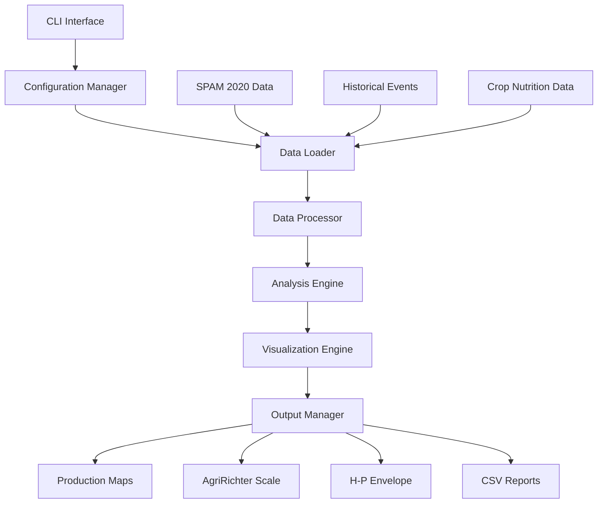

# Design Document

## Overview

The AgriRichter Python system is designed as a modular, extensible framework for analyzing agricultural production disruptions. The architecture follows a pipeline pattern with distinct stages for data loading, processing, analysis, and visualization. The system transforms SPAM 2020 agricultural data and historical disruption events into quantitative measurements and publication-quality visualizations.

The core innovation is the AgriRichter Scale, which applies earthquake magnitude scaling concepts to agricultural disruptions, enabling comparative analysis of historical events and risk assessment for future scenarios.

## Architecture

### High-Level Architecture



### Component Architecture

The system is organized into six main modules:

1. **Core Module** (`agririchter/core/`): Configuration, constants, and utilities
2. **Data Module** (`agririchter/data/`): Data loading and validation
3. **Processing Module** (`agririchter/processing/`): Data transformation and calculations
4. **Analysis Module** (`agririchter/analysis/`): AgriRichter scale and envelope computations
5. **Visualization Module** (`agririchter/visualization/`): Figure generation
6. **CLI Module** (`agririchter/cli/`): Command-line interface

## Components and Interfaces

### Configuration Manager

**Purpose**: Centralized configuration management for file paths, parameters, and settings.

**Interface**:
```python
class Config:
    def __init__(self, crop_type: str, root_dir: str = None)
    def get_crop_indices(self) -> List[int]
    def get_caloric_content(self) -> Dict[str, float]
    def get_thresholds(self) -> Dict[str, float]
    def get_file_paths(self) -> Dict[str, str]
```

**Key Responsibilities**:
- Manage crop-specific parameters (indices, caloric content, thresholds)
- Handle file path resolution for different data sources
- Validate configuration parameters
- Support different crop types (allgrain, wheat, rice)

### Data Loader

**Purpose**: Load and validate SPAM 2020 data, historical events, and ancillary data.

**Interface**:
```python
class DataLoader:
    def __init__(self, config: Config)
    def load_spam_production(self) -> pd.DataFrame
    def load_spam_harvest_area(self) -> pd.DataFrame
    def load_historical_events(self) -> Dict[str, pd.DataFrame]
    def load_nutrition_data(self) -> pd.DataFrame
    def validate_data(self, data: pd.DataFrame) -> bool
```

**Key Responsibilities**:
- Load SPAM 2020 CSV files with proper data types
- Parse historical disruption event data
- Validate data integrity and completeness
- Handle missing data and provide informative error messages

### Data Processor

**Purpose**: Transform raw data into analysis-ready formats with unit conversions.

**Interface**:
```python
class DataProcessor:
    def __init__(self, config: Config)
    def convert_production_to_kcal(self, production_df: pd.DataFrame) -> pd.DataFrame
    def convert_harvest_area_to_km2(self, harvest_df: pd.DataFrame) -> pd.DataFrame
    def filter_crop_data(self, data: pd.DataFrame) -> pd.DataFrame
    def create_production_grid(self, data: pd.DataFrame) -> np.ndarray
    def calculate_yields(self, production: pd.DataFrame, harvest: pd.DataFrame) -> pd.DataFrame
```

**Key Responsibilities**:
- Convert metric tons to grams to kilocalories
- Convert hectares to square kilometers
- Filter data for specific crop types
- Create gridded data for mapping
- Calculate productivity metrics (yield = production/harvest area)

### Analysis Engine

**Purpose**: Core AgriRichter scale calculations and envelope computations.

**Interface**:
```python
class AgriRichterAnalyzer:
    def __init__(self, config: Config)
    def calculate_hp_envelope(self, production: pd.DataFrame, harvest: pd.DataFrame) -> Tuple[np.ndarray, np.ndarray]
    def compute_event_losses(self, events: Dict, production: pd.DataFrame, harvest: pd.DataFrame) -> pd.DataFrame
    def calculate_magnitude(self, harvest_area_km2: float) -> float
    def classify_event_severity(self, production_loss: float) -> str
```

**Key Responsibilities**:
- Sort grid cells by productivity for envelope calculation
- Compute cumulative sums for upper and lower bounds
- Calculate AgriRichter magnitude: M_D = log10(disrupted harvest area in km²)
- Process historical events to determine contemporary impact
- Classify events by severity thresholds (T1-T4)

### Visualization Engine

**Purpose**: Generate publication-quality figures with consistent styling.

**Interface**:
```python
class VisualizationEngine:
    def __init__(self, config: Config)
    def create_production_map(self, production_grid: np.ndarray) -> plt.Figure
    def create_agririchter_scale(self, events: pd.DataFrame) -> plt.Figure
    def create_hp_envelope(self, envelope_data: Tuple, events: pd.DataFrame) -> plt.Figure
    def save_figure(self, fig: plt.Figure, filename: str, formats: List[str])
```

**Key Responsibilities**:
- Create Robinson projection maps using Cartopy
- Apply consistent color schemes and styling
- Generate log-scale plots with proper axis formatting
- Save figures in multiple formats (SVG, EPS, JPG) at 300 DPI
- Handle map projections and coastline rendering

### Output Manager

**Purpose**: Organize and save analysis results and generated files.

**Interface**:
```python
class OutputManager:
    def __init__(self, config: Config, output_dir: str)
    def save_event_data(self, events: pd.DataFrame, crop_type: str)
    def save_envelope_data(self, envelope: Tuple, crop_type: str)
    def generate_summary_report(self, results: Dict)
    def organize_outputs(self)
```

**Key Responsibilities**:
- Create organized directory structure for outputs
- Save CSV files with event loss data
- Generate summary reports with key statistics
- Maintain consistent file naming conventions

## Data Models

### SPAM Data Model

```python
@dataclass
class SPAMData:
    iso3: str
    cell5m: int
    x: float  # longitude
    y: float  # latitude
    production: Dict[str, float]  # crop_name -> metric tons
    harvest_area: Dict[str, float]  # crop_name -> hectares
```

### Historical Event Model

```python
@dataclass
class HistoricalEvent:
    name: str
    countries: List[str]
    states: List[str]
    harvest_area_loss: float  # hectares
    production_loss: float  # kcal
    magnitude: float  # AgriRichter magnitude
    severity_class: str  # T1, T2, T3, T4
```

### Envelope Data Model

```python
@dataclass
class HPEnvelope:
    disrupted_areas: np.ndarray  # km²
    lower_bound_production: np.ndarray  # kcal
    upper_bound_production: np.ndarray  # kcal
    crop_type: str
```

## Error Handling

### Data Validation Errors

- **Missing Files**: Provide clear error messages with expected file locations
- **Invalid Data Formats**: Validate CSV structure and data types
- **Coordinate Validation**: Check latitude (-90 to 90) and longitude (-180 to 180) ranges
- **Missing Crop Data**: Handle cases where specific crops have no data

### Processing Errors

- **Unit Conversion Failures**: Validate numeric data before conversions
- **Grid Creation Errors**: Handle coordinate mapping issues
- **Calculation Errors**: Check for division by zero and invalid mathematical operations

### Visualization Errors

- **Projection Errors**: Handle coordinate system transformation issues
- **File Save Errors**: Validate output directory permissions and disk space
- **Memory Errors**: Implement chunked processing for large datasets

## Testing Strategy

### Unit Tests

- **Data Loading**: Test CSV parsing, validation, and error handling
- **Unit Conversions**: Verify metric tons to kcal and hectares to km² conversions
- **Mathematical Calculations**: Test envelope computations and magnitude calculations
- **Configuration Management**: Validate parameter loading and crop-specific settings

### Integration Tests

- **End-to-End Pipeline**: Test complete workflow from data loading to figure generation
- **Cross-Module Communication**: Verify data flow between components
- **File I/O Operations**: Test reading input files and writing output files

### Performance Tests

- **Large Dataset Handling**: Test with full SPAM 2020 dataset
- **Memory Usage**: Monitor memory consumption during processing
- **Processing Time**: Benchmark analysis pipeline performance

### Validation Tests

- **Result Verification**: Compare outputs with original MATLAB results
- **Figure Quality**: Verify publication-quality output specifications
- **Data Integrity**: Ensure no data loss during transformations

## Dependencies

### Core Dependencies

- **pandas**: Data manipulation and analysis
- **numpy**: Numerical computations
- **matplotlib**: Base plotting functionality
- **cartopy**: Map projections and geospatial visualization
- **geopandas**: Geospatial data handling

### Visualization Dependencies

- **seaborn**: Statistical visualization enhancements
- **cmocean**: Scientific colormaps
- **adjustText**: Automatic text positioning for labels

### Development Dependencies

- **pytest**: Testing framework
- **black**: Code formatting
- **mypy**: Type checking
- **sphinx**: Documentation generation

## Performance Considerations

### Memory Management

- Use chunked processing for large datasets
- Implement lazy loading for optional data
- Clear intermediate variables to free memory

### Computational Efficiency

- Vectorize operations using NumPy
- Use efficient pandas operations for data manipulation
- Cache expensive computations when possible

### I/O Optimization

- Use efficient file formats (Parquet for intermediate data)
- Implement parallel processing for independent operations
- Optimize figure rendering for large datasets

## Security Considerations

### Input Validation

- Sanitize file paths to prevent directory traversal
- Validate numeric inputs to prevent overflow
- Check file permissions before reading/writing

### Data Integrity

- Implement checksums for critical data files
- Validate data consistency across related datasets
- Log all data transformations for audit trails